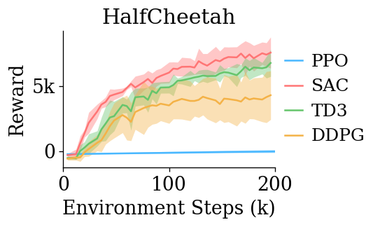

# All baselines on Cheetah-v2

As mentioned in the Spinup documentation, the PPO 
implementation here is not on-par with SOTA. The SAC,
DDPG and TD3 implementations however are. 

The `mrl` library attains stronger performance.

