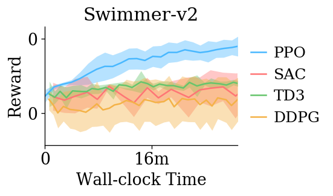

# Baselines on All gym MuJoCo Tasks

This is still worse than the benchmark result from 
the spinup code base. For next steps:

- [ ] find the exact parameters used for training
- [ ] run later tonight.

Should be able to reproduce the results tomorrow.

