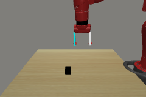
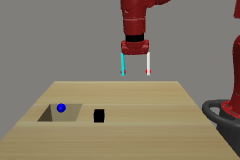

# List of environments from metaworld

We take the simple MT10 (multi-task 10 suite)

```python
import metaworld
import random
from env_wrappers.metaworld import RenderEnv

mt10 = metaworld.MT50()  # Construct the benchmark, sampling tasks
for name, __Env__ in mt10.train_classes.items():
    print(name)
    env = __Env__()
    task = random.choice([task for task in mt10.train_tasks if task.env_name == name])
    env.set_task(task)
    env = RenderEnv(env)
    env.reset()
    img = env.render('rgb', width=240, height=160)
    doc.image(img, f"figures/task_{name}.png", caption=name)
    env.close()
```
<div style="flex-wrap:wrap; display:flex; flex-direction:row; item-align:center;"><div><div style="text-align: center">reach-v1</div></div><div><div style="text-align: center">push-v1</div></div><div><div style="text-align: center">pick-place-v1</div></div><div><div style="text-align: center">door-open-v1</div></div><div><div style="text-align: center">drawer-open-v1</div></div><div><div style="text-align: center">drawer-close-v1</div></div><div><div style="text-align: center">button-press-topdown-v1</div></div><div><div style="text-align: center">peg-insert-side-v1</div></div><div><div style="text-align: center">window-open-v1</div></div><div><div style="text-align: center">window-close-v1</div></div><div><div style="text-align: center">door-close-v1</div></div><div><div style="text-align: center">reach-wall-v1</div></div><div><div style="text-align: center">pick-place-wall-v1</div></div><div><div style="text-align: center">push-wall-v1</div></div><div><div style="text-align: center">button-press-v1</div></div><div><div style="text-align: center">button-press-topdown-wall-v1</div></div><div><div style="text-align: center">button-press-wall-v1</div></div><div><div style="text-align: center">peg-unplug-side-v1</div></div><div><div style="text-align: center">disassemble-v1</div></div><div><div style="text-align: center">hammer-v1</div></div><div><div style="text-align: center">plate-slide-v1</div></div><div><div style="text-align: center">plate-slide-side-v1</div></div><div><div style="text-align: center">plate-slide-back-v1</div></div><div><div style="text-align: center">plate-slide-back-side-v1</div></div><div><div style="text-align: center">handle-press-v1</div></div><div><div style="text-align: center">handle-pull-v1</div></div><div><div style="text-align: center">handle-press-side-v1</div></div><div><div style="text-align: center">handle-pull-side-v1</div></div><div><div style="text-align: center">stick-push-v1</div></div><div><div style="text-align: center">stick-pull-v1</div></div><div><div style="text-align: center">basketball-v1</div></div><div><div style="text-align: center">soccer-v1</div></div><div><div style="text-align: center">faucet-open-v1</div></div><div><div style="text-align: center">faucet-close-v1</div></div><div><div style="text-align: center">coffee-push-v1</div></div><div><div style="text-align: center">coffee-pull-v1</div></div><div><div style="text-align: center">coffee-button-v1</div></div><div><div style="text-align: center">sweep-v1</div></div><div><div style="text-align: center">sweep-into-v1</div></div><div><div style="text-align: center">pick-out-of-hole-v1</div></div><div><div style="text-align: center">assembly-v1</div></div><div><div style="text-align: center">shelf-place-v1</div></div><div><div style="text-align: center">push-back-v1</div></div><div><div style="text-align: center">lever-pull-v1</div></div><div><div style="text-align: center">dial-turn-v1</div></div><div><div style="text-align: center">bin-picking-v1</div></div><div><div style="text-align: center">box-close-v1</div></div><div><div style="text-align: center">hand-insert-v1</div></div><div><div style="text-align: center">door-lock-v1</div></div><div><div style="text-align: center">door-unlock-v1</div></div></div>
