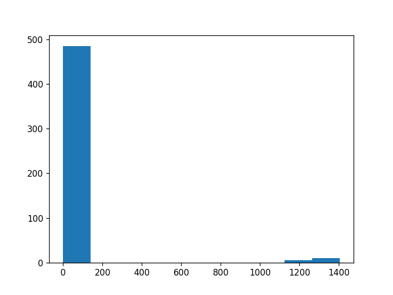

# Instantiate A Single Environment

We pick two environments:

```python
tasks = ["box-close-v1", "bin-picking-v1"]
```

# To-dos

Next step we need to figure out a way to register these environments
with gym, to randomly initialize the tasks.
Need to figure out a way to hook this up to regular gym.

1. register the environment directly
2. set task (figure out where the task comes from, because it is an object)

Then everything is just regular stuff

```yaml
    box-close-v1: <class 'metaworld.envs.mujoco.sawyer_xyz.sawyer_box_close.SawyerBoxCloseEnv'>
    bin-picking-v1: <class 'metaworld.envs.mujoco.sawyer_xyz.sawyer_bin_picking.SawyerBinPickingEnv'>
    ```
```python
rewards = []
for task_name in tasks:
    ml1 = metaworld.MT1(task_name)  # Construct the benchmark, sampling tasks

    Env = ml1.train_classes[task_name]
    test_env_classes[task_name] = Env
    doc.text(f"{task_name}: {Env}", sep="\n")
```
box-close-v1: <class 'metaworld.envs.mujoco.sawyer_xyz.sawyer_box_close.SawyerBoxCloseEnv'>
bin-picking-v1: <class 'metaworld.envs.mujoco.sawyer_xyz.sawyer_bin_picking.SawyerBinPickingEnv'>
```python
for task_name, Env in test_env_classes.items():
    ml1 = metaworld.MT1(task_name)  # Construct the benchmark, sampling tasks

    Env = ml1.train_classes[task_name]
    env = Env()  # Create an environment with task `pick_place`
    env = RenderEnv(env)

    frames = []
    for t_id, task in enumerate(ml1.train_tasks):
        env.set_task(task)  # Set task
        obs = env.reset()  # Reset environment
        a = env.action_space.sample()  # Sample an action
        for i in range(5):
            obs, r, done, info = env.step(a)  # Step the environment with the sampled
            img = env.render("rgb", width=72, height=48)
            frames.append(img)
            rewards.append(r)

    doc.video(frames, f"videos/{task_name}.gif", caption=task_name, width=240, height=160)
    env.close()
```
<div style="flex-wrap:nowrap; display:flex; flex-direction:row; item-align:center;"><div><div style="text-align: center">box-close-v1</div></div><div><div style="text-align: center">bin-picking-v1</div></div></div>
Now show the reward distribution
```python
import matplotlib.pyplot as plt

plt.hist(rewards, bins=10, histtype='stepfilled')
doc.savefig(f"figures/single_env/reward_dist.png", dpi=120, zoom="30%")
```

