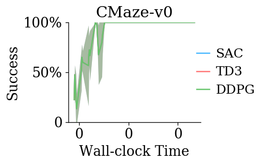
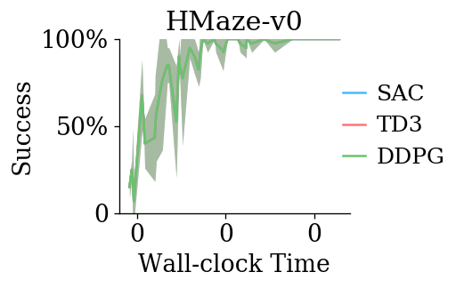
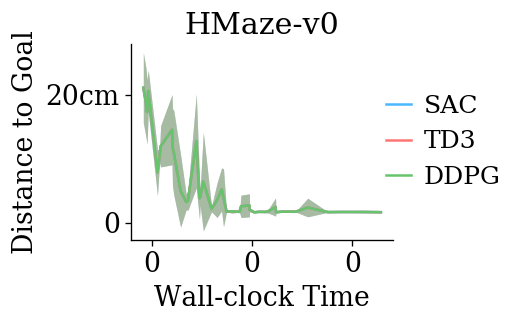

# Continuous Control Baselines with Maze Environments

Include ppo, sac, td3 and ddpg.

- [ ] add goal-conditioning
- [ ] add her

``` python
# methods = ['ppo', 'sac', 'td3', 'ddpg']
methods = ['sac', 'td3', 'ddpg']
env_ids = [
    "ge_world:Maze-v0",
    "ge_world:CMaze-v0",
    "ge_world:HMaze-v0",
]
short_names = [d.split(':')[-1] for d in env_ids]
prefix = "/geyang/playground/2020/08-15/uvpn_baselines/cont_maze/14.36.51"
```

Experiment: [[cont_maze]](http://localhost:3001/geyang/playground/2020/08-15/uvpn_baselines/cont_maze/14.36.51)

<div style="flex-wrap:wrap; display:flex; flex-direction:row; item-align:center;"></div>
<div style="flex-wrap:wrap; display:flex; flex-direction:row; item-align:center;"></div>
<div style="flex-wrap:wrap; display:flex; flex-direction:row; item-align:center;"></div>
``` python
if not prefix:
    import jaynes
    from firedup.algos.ppo.ppo import ppo
    from firedup.algos.sac.sac import sac
    from firedup.algos.td3.td3 import td3
    from firedup.algos.ddpg.ddpg import ddpg
    from pg_experiments import instr

    jaynes.config("local" if "pydevd" in sys.modules else "cpu-mars")

    for method in methods:
        for env_id, name in zip(env_ids, short_names):
            for seed in [100, 200, 300, 400, 500]:
                video_interval = 5 if seed == 100 else None
                charts = [dict(type="video", glob="**/*.mp4")] if seed == 100 else []
                thunk = instr(eval(method),
                              env_id=env_id,
                              seed=seed,
                              wrappers=(FlatEnv,),
                              ac_kwargs=dict(hidden_sizes=[128, ] * 3),
                              gamma=0.99,
                              ep_limit=50,
                              steps_per_epoch=4000,
                              epochs=500 if method == "ppo" else 50,
                              video_interval=video_interval,
                              _config=dict(charts=["success/mean", "dist/mean", *charts]),
                              _job_postfix=f"{name}/{method}")

                jaynes.run(thunk)

    jaynes.listen()
```
