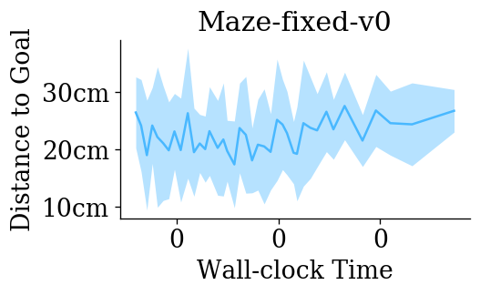
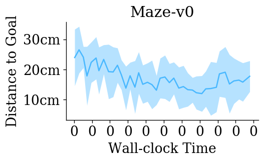
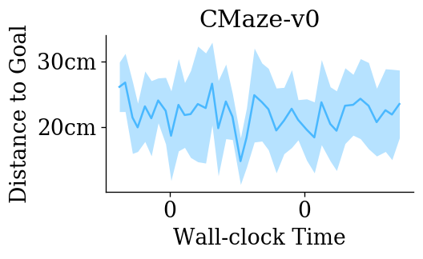
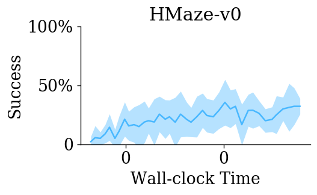
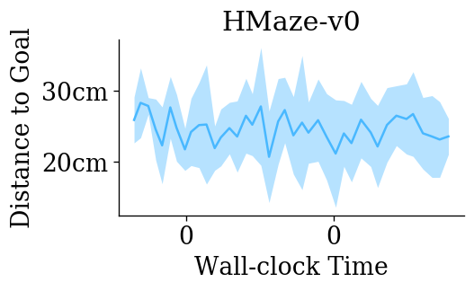

# DQN result on Maze (discrete) 

``` python
env_ids = [
    "ge_world:Maze-fixed-discrete-v0",
    "ge_world:Maze-discrete-v0",
    "ge_world:CMaze-discrete-v0",
    "ge_world:HMaze-discrete-v0",
]
short_names = [d.split(':')[-1].replace("-discrete", "") for d in env_ids]
prefix = "/geyang/playground/2020/08-14/uvpn_baselines/dqn_maze/02.40.21"
```

Experiment: [[dqn_maze]](http://localhost:3001/geyang/playground/2020/08-14/uvpn_baselines/dqn_maze/02.40.21)

<div style="flex-wrap:wrap; display:flex; flex-direction:row; item-align:center;"></div>
<div style="flex-wrap:wrap; display:flex; flex-direction:row; item-align:center;"></div>
<div style="flex-wrap:wrap; display:flex; flex-direction:row; item-align:center;"></div>
<div style="flex-wrap:wrap; display:flex; flex-direction:row; item-align:center;"></div>

Launch Script: 

``` python
# launch training
if not prefix:
    import jaynes
    from firedup.algos.dqn.dqn_her import dqn
    from pg_experiments import instr

    debug = "pydevd" in sys.modules
    jaynes.config("local" if debug else 'cpu-mars')

    for env_id, env_name in zip(env_ids, short_names):
        for seed in [100, 200, 300, 400, 500]:
            thunk = instr(dqn,
                          env_id=env_id,
                          env_kwargs=dict(r=0.02),
                          obs_keys=("x", "goal"),
                          replay_size=40_000,
                          her_k=1,
                          optim_epochs=1,
                          max_ep_len=50,
                          ac_kwargs=dict(hidden_sizes=[32, ] * 2),
                          gamma=0.985,
                          target_update_interval=1000,
                          seed=seed,
                          steps_per_epoch=4000,
                          epsilon_train=0.2,
                          epsilon_decay_period=200_000,
                          epochs=100,
                          _job_prefix="debug" if debug else None,
                          _job_postfix=f"{env_name}/s{seed}")
            jaynes.run(thunk)

    doc.print('Launching@', logger.prefix)
```
